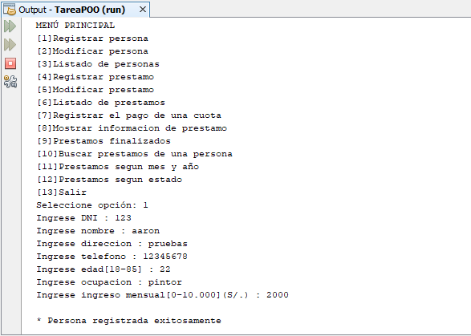

# sistema-prestamos
Sistema sobre prestamos a personas donde se puede registrar una persona, modificar su información, listar las personas registradas, registra un prestado, modificar un préstamo, listar los prestamos registrados, registrar el pago de una cuota del prestamos; en los reportes tenemos mostrar información de un préstamo, mostrar los prestamos finalizados, mostrar los prestamos de una persona, mostrar los prestamos según su mes y año, y mostrar los prestamos según su tipo, **11/12/19**.

<strong>Imagen:</strong> Menú principal - Registrar persona.

